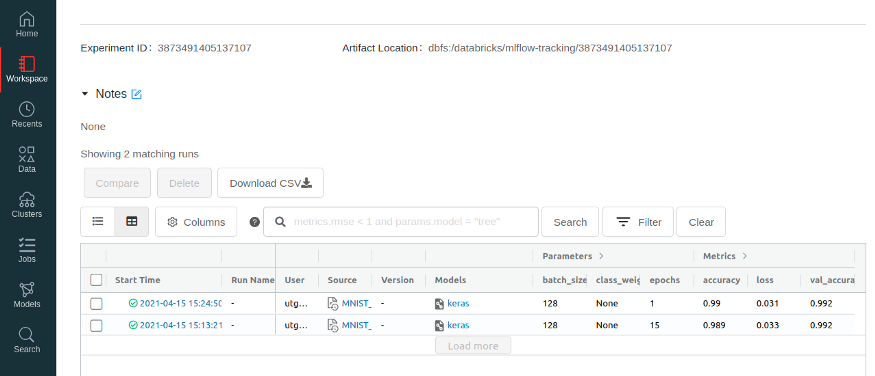
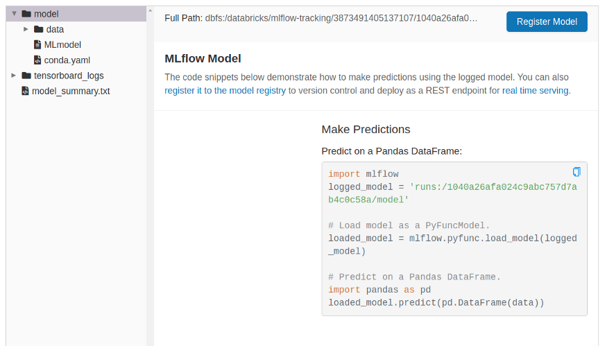

## Versioning

Once training of our model is finished, we can view the logs of the experiment attached to this script/notebook - here we get an overview of the models trained as part of this notebook and metrics and parameters for each model (e.g., loss over time, etc.). We can click the source buttons which will show us exactly what code was used to train the model. This means we will be able to audit any model in production to see exactly who trained it and how.

